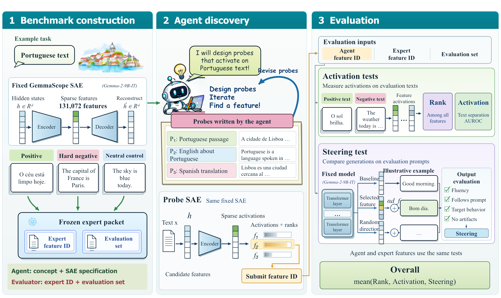
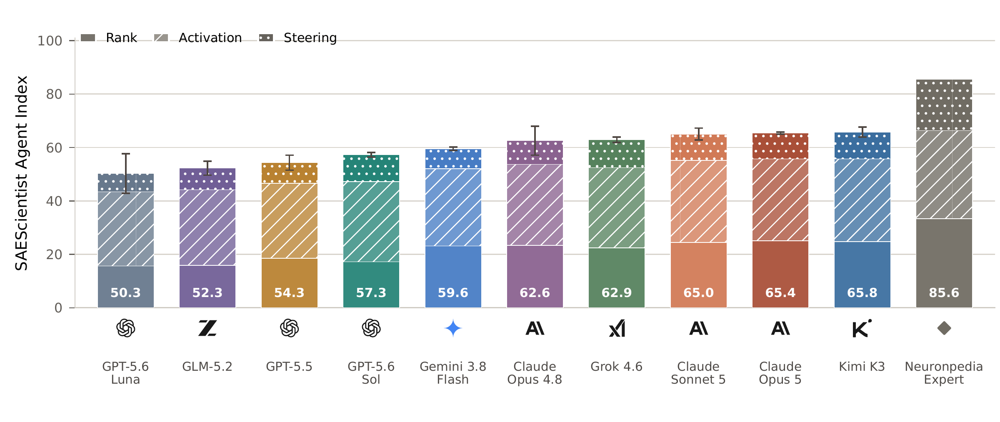

<div align="center">

# SAEScientist-Bench

### Can AI Agents Conduct Autonomous SAE Interpretability Research?

[Overview](#overview) · [Agent Index](#agent-index) · [Quick Start](#quick-start) · [Scoring](#scoring)

</div>

## Overview

SAEScientist-Bench evaluates whether AI agents can use sparse autoencoders (SAEs)
to investigate trained language models. Given a concept, an agent writes probe
texts, examines activations, compares candidate features, and submits a feature
for evaluation. The benchmark measures how well that feature identifies the
concept and steers model behavior.

The benchmark contains **20 tasks across 17 concepts**, using **Gemma-2-9B-IT**
and Gemma Scope dictionaries with **131,072 features** at layers 9 and 20.
This repository provides the dataset, agent interfaces, and experiment and scoring
code used to run the benchmark.



Agents receive the concept and SAE specification. The evaluator uses the Expert
feature and evaluation set to measure **Rank**, **Activation**, and **Steering**.
See the [dataset guide](docs/dataset.md) for task definitions and feature sources.

## Agent Index



Each bar shows the Overall score, with equally weighted contributions from Rank,
Activation, and Steering. Error bars show standard deviations across three independent runs.
Neuronpedia Expert provides the comparison baseline.

## Quick Start

### 1. Install

Use Python 3.10+ on Linux with an NVIDIA GPU. The GPU must hold Gemma-2-9B-IT
and the full SAE dictionary. Tasks run sequentially on one GPU.

```bash
git clone https://github.com/Trae1ounG/SAEScientist.git
cd SAEScientist
python -m venv .venv
source .venv/bin/activate
pip install -e .
```

Install and authenticate the agent CLI you want to evaluate. The experiment runner
supports the [Codex](agents/codex/solve.sh) and [Cursor](agents/cursor/solve.sh)
adapters. PyTorch must be installed with CUDA support for your machine.

### 2. Download the model and SAE

The task descriptions, activation texts, steering prompts, and Expert
configurations are included in the repository. Download the model weights after
accepting the [Gemma access terms](https://huggingface.co/google/gemma-2-9b-it):

```bash
hf auth login
hf download google/gemma-2-9b-it --local-dir checkpoints/gemma-2-9b-it
hf download google/gemma-scope-9b-it-res \
  layer_9/width_131k/average_l0_121/params.npz \
  layer_20/width_131k/average_l0_81/params.npz \
  --revision e86af97a5b6fbbccca28ab654f2fda1b0768f770 \
  --local-dir checkpoints/gemma-scope-9b-it-res
```

The default configuration uses these paths. If your weights are stored elsewhere,
update `model_path` and `sae_root` in [`configs/benchmark.json`](configs/benchmark.json).

### 3. Configure the agent and judge

In [`configs/benchmark.json`](configs/benchmark.json), set:

- `agent.harness` to `codex` or `cursor`, and `agent.cli` to its executable.
- `agent.model` to the agent model you want to evaluate. Set its reasoning effort
  and time budget under the same `agent` section.
- `judge.model` to your Azure OpenAI deployment serving **4o**.

Gemma-2-9B-IT remains the model being investigated. Provide the judge credentials
through environment variables:

```bash
export AZURE_OPENAI_API_KEY='<your-key>'
export AZURE_OPENAI_ENDPOINT='https://<resource>.openai.azure.com/'
export OPENAI_API_VERSION='<supported-api-version>'
```

### 4. Run experiments

Run one task with one agent attempt:

```bash
python scripts/run_benchmark.py --config configs/benchmark.json \
  --task-id gemma_cat_001 --replicates 1 --output-dir outputs/cat
```

Run all **20 tasks with three independent repeats**:

```bash
python scripts/run_benchmark.py --config configs/benchmark.json \
  --output-dir outputs/benchmark
```

The runner starts the SAE probe service, runs agent discovery, evaluates the
submitted feature, selects steering strength on calibration prompts, generates
the evaluation responses, and obtains judge ratings. Scores are saved to
`outputs/benchmark/summary.json`.

Use a new output directory for each experiment. For another agent, change the
agent configuration and choose a different directory.
[Running experiments](docs/experiments.md) covers task selection, configuration
options, and troubleshooting. [Paper protocol](docs/protocol.md) documents the
task-specific settings.

## Scoring

| Score | What it measures |
|---|---|
| **Rank** | The feature's activation rank in the dictionary compared with Expert. |
| **Activation** | Separation of positive and control texts, measured with AUROC. |
| **Steering** | Target behavior gained over the unmodified model and random-direction control. |
| **Overall** | The mean of Rank, Activation, and Steering. |

Scores are computed automatically during the experiment. Task scores are averaged
equally within each repeat, then summarized across repeats.

To recompute scores from a completed experiment:

```bash
python scripts/run_benchmark.py --config configs/benchmark.json \
  --output-dir outputs/benchmark --score-only
```

Use the same configuration, task selection, and repeat count as the original run.
This command reads the saved measurements and updates `summary.json`.
See [Evaluation](docs/evaluation.md) for the formulas, judge rubric, and individual
task scoring.
