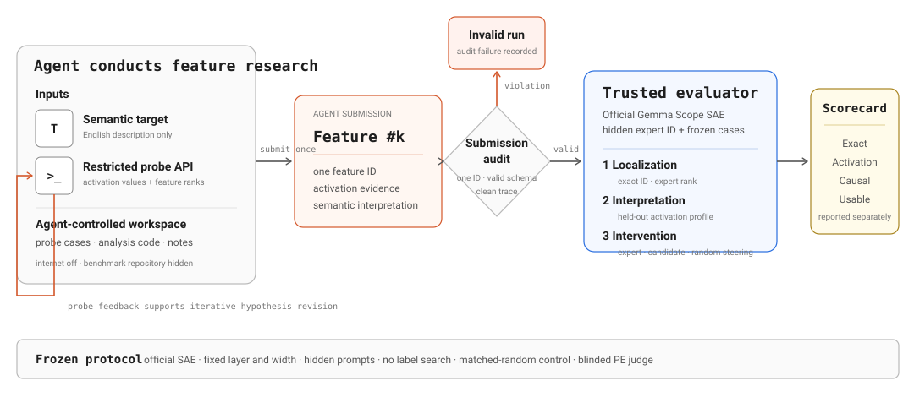

# SAEScientist-Bench

[中文](README.zh-CN.md) · [Interactive research blog](https://trae1oung.github.io/SAEScientist/) · [Three-run results](results/replicates.json)

**SAEScientist-Bench evaluates whether an AI agent can independently investigate and identify a sparse-autoencoder feature.**

The agent receives an English semantic target and a restricted activation-probe API. It writes diagnostic examples, compares feature activations, revises its hypothesis, and submits one Feature ID. A hidden evaluator then checks whether the submitted feature matches the expert feature's activation pattern and causal steering behavior.

The experiment uses the official Google Gemma Scope SAE for `google/gemma-2-9b-it`: 20 expert feature/layer tasks, ten agent configurations, and three independent runs per configuration, for 600 trace-audited discovery episodes. Agents have no web access and cannot inspect benchmark code, hidden cases, expert IDs, or public feature labels.

## Architecture



The benchmark reports one normalized overall score plus diagnostic outcomes:

- **Exact:** whether the submitted ID equals the frozen expert ID.
- **Rank:** expert-normalized recovery of positive-case mean rank.
- **Activation:** expert-normalized recovery of AUROC, activation contrast, and per-case activation pattern.
- **Steering:** expert-normalized recovery of the control-adjusted target effect and per-instruction steering pattern.
- **Overall:** the equal-weight mean of Rank, Activation, and Steering for one task.
- **Causal:** whether feature steering induces the target more strongly than both control conditions.
- **Usable:** whether the target is induced without destroying the original user task.

Overall is averaged across the 20 tasks. The expert feature is the normalization
reference at 1.0, not a ceiling: candidates that outperform it on the same hidden
cases can score above 1.0.
Exact, Causal, and Usable remain audit columns rather than being counted again.

## Current evidence

Each entry is the mean ± population standard deviation over three independent runs.

| Rank | Model | Overall | Rank | Activation | Steering | Exact | Causal | Usable |
| ---: | --- | ---: | ---: | ---: | ---: | ---: | ---: | ---: |
| GT | Expert feature baseline | 1.000 | 1.000 | 1.000 | 1.000 | 100% | 60% | 0% |
| 1 | Claude Opus 5 High | 0.738 ± 0.007 | 0.753 ± 0.001 | 0.935 ± 0.003 | 0.526 ± 0.023 | 41.7% ± 2.4 | 18.3% ± 2.4 | 0.0% ± 0.0 |
| 2 | Claude Sonnet 5 High | 0.727 ± 0.024 | 0.734 ± 0.023 | 0.939 ± 0.020 | 0.508 ± 0.033 | 40.0% ± 8.2 | 16.7% ± 4.7 | 0.0% ± 0.0 |
| 3 | Kimi K3 High | 0.724 ± 0.021 | 0.743 ± 0.046 | 0.927 ± 0.007 | 0.503 ± 0.016 | 31.7% ± 4.7 | 15.0% ± 0.0 | 0.0% ± 0.0 |
| 4 | Claude Opus 4.8 High | 0.705 ± 0.046 | 0.702 ± 0.052 | 0.929 ± 0.019 | 0.482 ± 0.071 | 35.0% ± 8.2 | 13.3% ± 4.7 | 0.0% ± 0.0 |
| 5 | Grok 4.6 High | 0.701 ± 0.005 | 0.672 ± 0.025 | 0.919 ± 0.001 | 0.513 ± 0.034 | 33.3% ± 6.2 | 16.7% ± 6.2 | 0.0% ± 0.0 |
| 6 | Gemini 3.8 Flash High | 0.676 ± 0.012 | 0.695 ± 0.041 | 0.898 ± 0.020 | 0.436 ± 0.015 | 33.3% ± 6.2 | 10.0% ± 4.1 | 0.0% ± 0.0 |
| 7 | GPT-5.6 Sol High | 0.643 ± 0.006 | 0.516 ± 0.018 | 0.902 ± 0.007 | 0.511 ± 0.031 | 35.0% ± 0.0 | 16.7% ± 2.4 | 1.7% ± 2.4 |
| 8 | GPT-5.5 High | 0.611 ± 0.024 | 0.556 ± 0.043 | 0.876 ± 0.016 | 0.401 ± 0.046 | 25.0% ± 4.1 | 11.7% ± 2.4 | 0.0% ± 0.0 |
| 9 | GLM-5.2 High | 0.586 ± 0.028 | 0.477 ± 0.047 | 0.860 ± 0.020 | 0.420 ± 0.037 | 26.7% ± 6.2 | 13.3% ± 2.4 | 0.0% ± 0.0 |
| 10 | GPT-5.6 Luna High | 0.565 ± 0.063 | 0.469 ± 0.122 | 0.852 ± 0.014 | 0.373 ± 0.056 | 20.0% ± 7.1 | 10.0% ± 4.1 | 0.0% ± 0.0 |

The rescaling is symmetric around the Expert: higher-is-better quantities use
`2c/(c+e)`, while lower-is-better rank uses `2e/(c+e)`. The resulting 0–2 scale
preserves candidates that exceed the Expert instead of clipping them to 1.

The three-run experiment supports three observations:

1. Agents often find semantically related features without recovering the exact expert ID.
2. Activation similarity is informative but insufficient for causal equivalence: the activation–steering Spearman correlation is 0.694 overall and 0.328 among non-exact candidates.
3. Strong steering can erase the requested task. Causal target induction and usable control therefore need separate metrics.

Across 600 runs, 193 recover the exact expert ID, 85 pass the causal gate, and one passes the stricter usable gate. Five of 407 non-exact selections pass the causal gate.

Task difficulty is strongly associated with expert-anchor discoverability: the
expert's positive-case mean rank correlates with exact recovery at Spearman
`-0.810`. Among 407 non-exact selections, 317 attain Activation Score ≥ 0.8,
but only five pass the causal gate. A 10,000-sample paired task bootstrap places
Claude Opus 5, Claude Sonnet 5, and Kimi K3 in an unresolved top cluster on the
current 20 tasks. The machine-readable diagnostics are in
[`results/analysis.json`](results/analysis.json).

## Steering evaluation

For submitted feature `k`, the evaluator intervenes at the SAE layer with

```text
h'_t = h_t + alpha × W_dec[:, k]
```

`alpha` is chosen on five calibration prompts. Evaluation uses 20 separate held-out instructions and three conditions: baseline, the submitted feature, and a norm-matched random decoder direction. Their outputs are shuffled and anonymized before GPT-4o scores target relevance, task preservation, and degeneration twice at temperature zero.

The full judge prompt, label definitions, aggregation formulas, per-feature activation distributions, and steering examples are reported in the [research blog](https://trae1oung.github.io/SAEScientist/).

## Reproduce the public release

```bash
git clone https://github.com/Trae1ounG/SAEScientist.git
cd SAEScientist
git checkout website
npm ci
npm test
npm run dev
```

`npm test` builds the static GitHub Pages site and runs its data/content consistency checks. `npm run dev` starts the local interactive blog. The committed result snapshot is available directly:

```bash
jq '.replicates, .discovery_runs, .configurations' results/replicates.json
```

The public repository reproduces the reported analysis and website. Hidden prompts and sanitized raw agent traces remain in the private research repository; credentials are never stored, and machine-specific paths are removed from both repositories.

## Citation

Please cite this repository and the accessed commit when using the benchmark or reported results.
