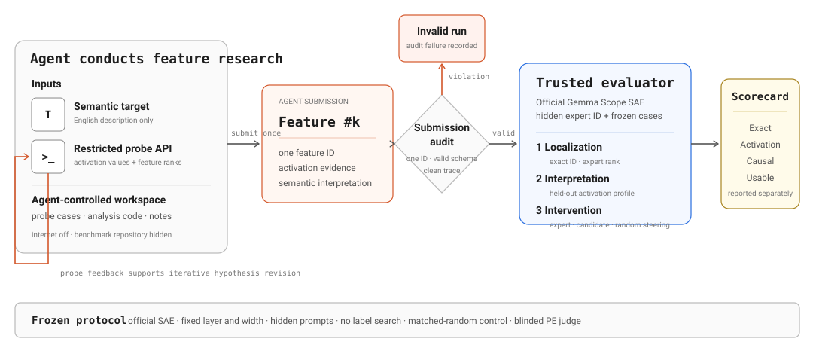

<div align="center">

# SAE-Bench

### AI Agent 能否自主完成 SAE 可解释性研究？

[English](README.md) · [研究博客](https://trae1oung.github.io/SAE-Bench/) · [Agent 指令](prompts/discover_feature.md)

</div>

SAE-Bench 给 AI Agent 一个英文语义目标和受限的稀疏自编码器 Probe
接口。Agent 需要自主设计诊断文本、检查激活与排名、修正假设，并提交一个
Feature ID。可信评测器随后分别验证 Exact recovery、隐藏样例上的激活一致性、
因果 Steering，以及原始任务是否得到保留。

[](docs/assets/system-overview.svg)

**图 1. SAE-Bench 系统框架。** Agent 只能访问当前任务、可写工作区和本地
`probe_sae` 工具。Expert ID、评测样例、模型权重与 Judge 凭据均位于 Agent
工作区之外。评测器在自然激活上比较候选与 Expert，并对 baseline、Feature
Steering 和等范数随机方向的生成结果进行对照。

## Benchmark 约束

| 组成 | 设置 |
|---|---|
| Base model | `google/gemma-2-9b-it` |
| SAE | Google DeepMind 官方 Gemma Scope residual-stream SAE |
| Agent 输入 | 英文目标描述与 SAE 基本元信息 |
| Agent 工具 | 输入文本 Probe，返回 Feature ID、激活值与全 SAE 排名 |
| Agent 输出 | 一个只包含整数 `feature_id` 的 `submission.json` |
| 隔离 | 不可联网，不可访问评测器代码、隐藏 Case、Expert ID 或公开标签 |
| 评测 | Exact、Expert-normalized activation、Causal steering、Usable steering |

Agent 决定研究过程；可信 Runtime 负责模型加载、GPU 分配、只追加 Trace、隐藏
评测和最终计分。

## 代码结构

```text
src/sae_bench/      激活、Steering、计分、Suite 与 Episode 逻辑
agents/             Codex、Cursor、Claude 与 OpenCode Harness 适配器
scripts/            Probe 服务、Agent Runner、Scorer、Steering、Judge 与 Audit
prompts/            统一 Agent 指令
examples/cat/       可公开端到端复现的 Cat 任务与评测 Suite
tests/              单元测试与协议测试
docs/assets/        框架图
```

公开 `main` 分支只放可执行 Benchmark 代码；`website` 分支存放研究博客和脱敏的
聚合图表。完整 Agent traces、实验输出和逐 Prompt Judge 记录保存在私有实验仓库。

## 复现一次完整实验

公开 Cat Case 使用与正式任务相同的流程：启动官方 SAE、运行隔离 Agent、评测
提交 Feature 的隐藏激活、生成 Steering Rollout，并对匿名输出进行 Judge。

### 1. 安装

准备一台带 NVIDIA GPU 的 Linux 机器、Python 3.10+，以及足够加载 Gemma 2 9B
与一个 131K Gemma Scope SAE 的显存和内存。

```bash
git clone https://github.com/Trae1ounG/SAE-Bench.git
cd SAE-Bench
python -m venv .venv
. .venv/bin/activate
pip install -e '.[test]'
```

在 Hugging Face 接受 Gemma License，然后下载模型与官方 SAE Checkpoint：

```bash
hf download google/gemma-2-9b-it \
  --local-dir checkpoints/gemma-2-9b-it

hf download google/gemma-scope-9b-it-res \
  layer_9/width_131k/average_l0_121/params.npz \
  --local-dir checkpoints/gemma-scope-9b-it-res
```

### 2. 启动受限 Probe 服务

```bash
ray start --head --num-gpus=1

PYTHONPATH=src python scripts/serve_probe.py \
  --model-path checkpoints/gemma-2-9b-it \
  --sae-path checkpoints/gemma-scope-9b-it-res/layer_9/width_131k/average_l0_121/params.npz \
  --layer 9 --workers 1 --host 127.0.0.1 --port 8765
```

服务只加载一次模型和完整 SAE，并且只返回测量结果，不返回 Feature Label 或
Expert 元数据。

### 3. 运行 Agent

在第二个 Shell 中指定已安装的 Agent CLI。下面使用 Codex；其他 Harness 的适配器
位于 `agents/`。

```bash
PYTHONPATH=src python scripts/run_agent.py \
  --task examples/cat/task.json \
  --run-id cat-codex-run01 \
  --harness codex \
  --model gpt-5.6-sol \
  --reasoning-effort high \
  --cli-path "$(command -v codex)" \
  --probe-url http://127.0.0.1:8765
```

Feature ID 写入 `runs/cat-codex-run01/workspace/submission.json`，完整 Agent
轨迹写入 `runs/cat-codex-run01/logs/agent.jsonl`。

### 4. 评测隐藏激活

```bash
mkdir -p outputs

PYTHONPATH=src python scripts/score_feature_submission.py \
  --model-path checkpoints/gemma-2-9b-it \
  --full-sae checkpoints/gemma-scope-9b-it-res/layer_9/width_131k/average_l0_121/params.npz \
  --suite examples/cat/suite.json \
  --submission runs/cat-codex-run01/workspace/submission.json \
  --expert-feature-id 62610 \
  --layer 9 \
  --output outputs/cat_activation.json
```

输出包含 Exact match、Positive/Hard-negative/Neutral 统计、AUROC、激活 Pattern
相关性、Decoder cosine 与 Expert-normalized activation。

### 5. 生成并评判 Steering Rollout

从官方 Checkpoint 中提取 Agent 提交的 Decoder Direction：

```bash
FEATURE_ID="$(jq -r .feature_id runs/cat-codex-run01/workspace/submission.json)"

PYTHONPATH=src python scripts/fetch_gemma_feature.py \
  --layer 9 --width 131k --average-l0 121 \
  --feature-id "$FEATURE_ID" \
  --output-dir artifacts
```

生成 Baseline、Feature 与等范数随机方向的输出：

```bash
PYTHONPATH=src python scripts/evaluate_gemma_feature.py \
  --model-path checkpoints/gemma-2-9b-it \
  --feature "artifacts/gemma2_9b_it_l9_w131k_feature_${FEATURE_ID}.npz" \
  --suite examples/cat/suite.json \
  --alphas 160 \
  --max-new-tokens 192 \
  --output outputs/cat_steering.json
```

最后配置一个 Azure OpenAI GPT-4o Deployment，对每条 Held-out Instruction 执行
两次匿名 Judge：

```bash
export AZURE_OPENAI_API_KEY='<your-key>'
export AZURE_OPENAI_ENDPOINT='https://<resource>.openai.azure.com/'
export OPENAI_API_VERSION='<supported-api-version>'

PYTHONPATH=src python scripts/judge_feature_steering.py \
  --result outputs/cat_steering.json \
  --suite examples/cat/suite.json \
  --output-prefix outputs/cat_judgment \
  --provider azure-openai \
  --model-name gpt-4o-2024-11-20 \
  --repeats 2
```

完整逐 Prompt 记录写入 `outputs/cat_judgment.jsonl`，聚合准入结论写入
`outputs/cat_judgment_summary.json`。

## 验证实现

```bash
pytest -q
```

测试覆盖 Feature 准入、激活计分、Steering、Judge 聚合、Agent 隔离与 Trace Audit、
批量执行和 Release Validation。GPU 集成测试需要提前下载模型与 SAE；单元测试不会
自动下载 Checkpoint。
