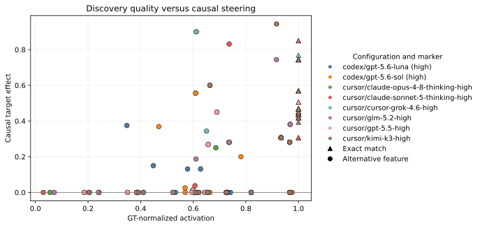

# SAE-Bench

[English](README.md) · [方法与分析](docs/benchmark_v2_blog.md) · [机器可读结果](results/leaderboard.json)

**SAE-Bench：评估 Agent 的自主 SAE 可解释性研究能力。**

Agent 只会看到英文研究目标和一个受限的 SAE probe 接口；它需要像研究者一样提出对照、构造诊断文本、运行激活实验、修正解释，并最终提交一个 feature ID 与证据。评测随后把三个问题分开：

1. 是否精确找到了 Expert feature？
2. 如果没有，它的自然激活模式是否仍与 Expert 接近？
3. 沿这个 feature 做 steering，能否因果地诱导目标行为，同时不破坏原任务？

当前版本基于 Google 官方发布的 Gemma Scope SAE 与 `google/gemma-2-9b-it`，包含 20 个 Expert 任务、8 个 Agent 配置和 160 次完整 discovery run。正式评测时 Agent 不可联网，也看不到 benchmark 源码、Expert ID、隐藏评测 case 或公开 feature label。

## 主结果

主排序指标是 macro GT-normalized activation：每道题的冻结 Expert feature 被归一化为 `1.0`。Exact match、因果 steering 和可用 steering 独立汇报，不压缩成一个不透明总分。

| 排名 | Agent 配置 | GT activation | Exact | Causal | Usable | 中位耗时 |
| ---: | --- | ---: | ---: | ---: | ---: | ---: |
| 1 | Kimi K3 High · Cursor | 0.794 | 35% | 45% | 5% | 5.0 分钟 |
| 2 | Grok 4.6 High · Cursor | 0.786 | 35% | 40% | 5% | 9.8 分钟 |
| 3 | Claude Sonnet 5 High · Cursor | 0.783 | 30% | 35% | 10% | 8.2 分钟 |
| 4 | Claude Opus 4.8 High · Cursor | 0.776 | 35% | 45% | 5% | 6.5 分钟 |
| 5 | GPT-5.6 Sol High · Codex | 0.752 | 35% | 40% | 5% | 4.1 分钟 |
| 6 | GPT-5.5 High · Cursor | 0.697 | 30% | 35% | 5% | 7.6 分钟 |
| 7 | GLM-5.2 High · Cursor | 0.692 | 20% | 30% | 10% | 5.7 分钟 |
| 8 | GPT-5.6 Luna High · Codex | 0.645 | 15% | 20% | 5% | 4.0 分钟 |

160 次运行中共有 47 次精确命中（29.4%）。整体上，激活相似度能够预测因果 steering；但只看非精确候选时，这个关系明显变弱：一个 feature 可以在自然激活上很像目标，却无法沿 Expert 的方向完成控制。



## 指标含义

- **Exact match**：提交的 feature ID 与冻结 Expert ID 完全相同。
- **GT-normalized activation**：相对 Expert 的正例平均排名、AUROC、正例与控制组激活差，以及激活 pattern 相关度的平均恢复比例。
- **Causal pass**：在固定 steering 与盲评协议下，目标诱导效果同时超过未 steering baseline 和等范数随机方向。
- **Usable pass**：除目标行为外，输出还需要保留原任务并避免退化。
- **Latency**：Agent 完成 discovery 的真实耗时，与质量指标分开报告。

我们刻意不提供一个统一总分。如果把“语义检索”和“因果控制”合在一起，SAE feature 最关键的失败模式反而会被隐藏。

## 评测流程

```text
目标语义
  │
  ▼
离线 Agent ── 自己构造 probe ──► 受限 SAE 接口
  │                              只返回激活和排名
  ▼
一个 feature ID
  │
  ├── 与 Expert 比较自然激活 pattern
  └── 与 baseline / 随机方向比较 steering
                         │
                         ▼
                       PE 盲评
```

Expert set 包含 20 个互不重复的 feature/layer 组合：12 个位于 residual layer 9，8 个位于 layer 20，覆盖语言、技术文体、领域写作和一般语义概念。所有 Expert direction 都通过冻结的因果准入流程：15 个处于 causal-only tier，另外 5 个还能通过更严格的任务保持型 `usable` tier。

## 公开边界

本仓库公开方法、Agent 提交与 Expert feature ID、逐运行聚合指标、行为分析和网站源码。隐藏 prompts 与 task payload、Agent 原始 trace、内部模型路径、judge endpoint 与逐 prompt PE 记录保留在独立私有研究仓库中。这样既能保持未来离线评测有效，也不会把内部基础设施写入公开 Git 历史。

完整 evaluator 会在 hidden/public split 固定后发布。当前 JSON 已足以复现网站上的所有聚合数字和实验图。

## 复现公开分析

交互式双语研究网站位于 `website` 分支：

```bash
npm ci
npm test
```

静态产物输出到 `dist-pages/`，可直接部署到 GitHub Pages。

## 当前状态

- Benchmark v2：20 题、160 次正式运行，已完成。
- Claude Opus 5 High：正在补跑完整 20 题；只有 discovery、activation scoring、steering 与 judge 全部通过后才会进入主榜。
- 论文：在私有研究仓库中准备。

## 引用

SAE-Bench 仍处于研究发布阶段。首版论文完成后会补充正式 BibTeX；目前请引用仓库链接和所使用的 commit。
