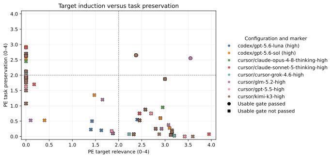

# SAE-Bench: Evaluating Feature Discovery as an Agent Task

> Formal v2 snapshot: 20 tasks, 8 agent configurations, and 160 trace-audited discovery runs.

Sparse autoencoders expose thousands of latent directions, but finding the direction that corresponds to a requested behavior is still a search problem. SAE-Bench turns that search into an offline agent task: given an English description and a restricted activation-probe tool, an agent must submit exactly one feature ID. Hidden evaluation then asks three separate questions. Did the agent recover the expert feature exactly? Does the submitted feature reproduce the expert's natural-activation pattern? Can the feature causally induce the intended behavior without destroying the original task?

The benchmark deliberately does not compress those questions into one score. Exact retrieval, activation-level discovery, causal steering, usability, and latency are reported separately.

## Dataset

Benchmark v2 contains 20 feature-selection tasks for `google/gemma-2-9b-it`. Twelve tasks use the official Google DeepMind Gemma Scope residual-stream SAE at layer 9 (`width_131k/average_l0_121`), and eight use the corresponding official layer-20 SAE (`width_131k/average_l0_81`). The tasks cover 17 semantic targets; earnings reports, portfolio allocation, and tax-filing language each appear once at both layers and remain distinct feature-discovery tasks.

Every task provides an English behavioral description, the model and SAE coordinates, the valid feature-ID range, and the required one-field submission schema. The hidden suite contains positive examples, difficult matched negatives, and neutral controls. Steering calibration prompts are separate from the held-out steering-evaluation prompts.

The benchmark manifest and each frozen reference point to a resolved revision of the model-owner-published SAE checkpoint. Public feature labels and external explanations are not part of the agent workspace.

## Agent protocol and isolation

The scored episode copies only the task and discovery instructions into a fresh workspace. The agent can query a benchmark-owned activation probe, which returns feature IDs, activation values, and full-SAE ranks. The final answer must be `{"feature_id": <integer>}`.

Scored discovery is offline. Benchmark source files and expert annotations are not copied into the episode workspace. Codex episodes run with ignored user configuration and rules, a least-privilege filesystem/network profile, and a preflight canary outside the workspace. Cursor episodes use isolated home, configuration, and data directories plus forced egress denial; authentication values are removed from the shell environment inherited by agent-created commands.

After execution, a trace audit checks the harness-specific event stream. It rejects web or non-probe MCP use, disallowed shell-network activity, out-of-workspace access, process/environment inspection where applicable, missing isolation preflight evidence, zero successful probe calls, and stale task snapshots. Only audit-eligible submitted runs enter hidden scoring. This audit establishes the implemented policy checks; it is not a general proof that arbitrary future harness versions are isolated.

## Natural-activation scoring

For each hidden text, the evaluator encodes SAE activations at the task's layer, removes special-token positions, and pools each feature using the mean of its top three token activations. The selected feature and expert feature are then ranked against the complete SAE dictionary.

The discovery metric is a task-normalized score in `[0, 1]`. It is the mean of four clipped recoveries:

1. positive mean-rank recovery: expert positive mean rank divided by candidate positive mean rank;
2. AUROC recovery above random: candidate AUROC above 0.5 divided by the expert's AUROC above 0.5;
3. activation-contrast recovery: candidate positive activation minus its stronger hard-negative/neutral control, normalized by the expert contrast;
4. Spearman agreement between candidate and expert activation patterns over the hidden cases.

The expert feature is therefore 1.0 on its own task. Exact match is reported independently: a semantically useful alternative can receive partial discovery credit, while a feature that ranks highly on positives but also activates on controls is penalized.

## Causal steering and the blinded judge

The selected decoder direction is calibrated on five prompts using an expert-centered strength grid. If every primary strength is degenerate, a fixed lower-strength safety grid is evaluated; this fallback was triggered for three of the 53 unique non-exact candidate features. Formal evaluation uses 20 held-out prompts with greedy generation and compares three conditions: unsteered baseline, submitted-feature steering, and a matched-norm random direction. Condition labels are shuffled before judging.

A blinded PE judge scores each output on target relevance from 0 to 4, task preservation from 0 to 4, and a separate degeneration flag. A target success requires relevance of at least 2. A usable target output additionally requires task preservation of at least 2 and must not be degenerate. The formal judge is repeated twice, and repeat agreement counts ratings that differ by at most one point.

The reported causal target effect is:

`feature target relevance / 4 - max(baseline target relevance, random target relevance) / 4`.

A causal pass also requires the frozen activation gate, at least 20 held-out prompts, a target-effect improvement of at least 0.20 over each control, at least 70% target success, at least 50% non-degenerate outputs, and at least 80% repeat agreement. The stricter usable gate additionally requires at least 50% usable target outputs and at least 90% non-degenerate outputs.

When the submitted ID exactly equals the frozen expert feature, the feature-level steering reference is reused. This avoids rerunning an identical direction, but it means those steering rows are frozen-reference reuse rather than a new agent-selected strength experiment.

## Leaderboard metrics

The comparison unit is the full configuration: harness, model, and reasoning effort. Scores are macro-averaged over feature tasks so each task contributes equally. The final table reports:

- completed-task coverage out of 20;
- macro GT-normalized activation for discovery quality;
- exact-match rate;
- causal-steering pass rate;
- usable-steering pass rate;
- median discovery wall-clock time.

Discovery wall-clock time measures the agent episode through submission. It excludes hidden activation scoring, steering generation, and PE judging, so it should not be interpreted as end-to-end benchmark latency. Duplicate run IDs, non-complete rows, and malformed compact results are excluded with explicit reason counts. Exact match is recomputed from the selected and expert IDs rather than trusted from an input flag.

## Results

<!-- RESULTS_SUMMARY_START -->
All eight configurations completed all 20 tasks, yielding 160/160 audited runs with no exclusions in the formal merge. Agents recovered the exact expert ID in 47 runs (29.4%). Kimi K3 led GT-normalized activation at 0.794, followed closely by Grok 4.6 at 0.786, Claude Sonnet 5 at 0.783, and Claude Opus 4.8 at 0.776. Exact retrieval was less finely separated: Kimi K3, Grok 4.6, Opus 4.8, and GPT-5.6 Sol each reached 7/20. Luna was fastest at a 4.0-minute median discovery time, with Sol close behind at 4.1 minutes.

The causal evaluation changes the interpretation of a "nearby" feature. Overall, 58/160 runs (36.3%) passed the causal gate and 10/160 (6.3%) passed the stricter usable gate. All 47 exact matches inherit a causally admitted frozen expert reference. Among the 113 non-exact selections, 11 (9.7%) passed the causal gate, but none passed the usable gate. Their mean control-adjusted target effect was 0.227 while the median was 0: 43/113 had a positive effect, but the effect was concentrated in a minority and often came with poor task preservation.

One case makes the distinction concrete. On the layer-9 tax-filing task, every configuration selected feature 64827 instead of the expert ID. It still achieved 0.934 mean GT-normalized activation and a 0.613 causal target effect, so it is a reproducible semantic alternative rather than arbitrary error; nevertheless, it failed the stricter usability criterion. In contrast, the cat task was an 8/8 exact match, while the French task produced four different alternatives, no exact matches, 0.432 mean normalized activation, and zero causal effect. Across all 160 runs, GT-normalized activation and causal effect had Spearman correlation 0.644; restricted to non-exact selections, the correlation fell to 0.394. Exact reuse therefore explains part, but not all, of the relationship between natural activation and intervention behavior.
<!-- RESULTS_SUMMARY_END -->

<!-- LEADERBOARD_TABLE_START -->
| Configuration | Coverage | Macro GT activation | Exact | Causal | Usable | Median discovery time |
| --- | ---: | ---: | ---: | ---: | ---: | ---: |
| cursor/kimi-k3-high | 20/20 | 0.794 | 0.350 | 0.450 | 0.050 | 5.0 min |
| cursor/cursor-grok-4.6-high | 20/20 | 0.786 | 0.350 | 0.400 | 0.050 | 9.8 min |
| cursor/claude-sonnet-5-thinking-high | 20/20 | 0.783 | 0.300 | 0.350 | 0.100 | 8.2 min |
| cursor/claude-opus-4-8-thinking-high | 20/20 | 0.776 | 0.350 | 0.450 | 0.050 | 6.5 min |
| codex/gpt-5.6-sol (high) | 20/20 | 0.752 | 0.350 | 0.400 | 0.050 | 4.1 min |
| cursor/gpt-5.5-high | 20/20 | 0.697 | 0.300 | 0.350 | 0.050 | 7.6 min |
| cursor/glm-5.2-high | 20/20 | 0.692 | 0.200 | 0.300 | 0.100 | 5.7 min |
| codex/gpt-5.6-luna (high) | 20/20 | 0.645 | 0.150 | 0.200 | 0.050 | 4.0 min |
<!-- LEADERBOARD_TABLE_END -->


The first plot places task-level GT-normalized activation on the x-axis and control-adjusted causal target effect on the y-axis. Color identifies the fixed configuration; marker shape separates exact matches from alternative features.



The second plot exposes the behavioral trade-off hidden by target induction alone. The dashed lines mark relevance and preservation scores of 2, while marker shape distinguishes runs that pass the full usable-steering gate.

## Limitations

SAE-Bench v2 evaluates one base model, two SAE layers, and 20 expert-selected feature tasks. The duplicated semantic targets across layers are useful paired cases but are not independent new concepts. A single submitted ID also measures the combined agent, harness, prompt, and reasoning configuration rather than the model in isolation.

The PE judge provides a reproducible operational rubric, not human ground truth. Its repeated judgments measure within-judge stability, and the matched-random direction controls for intervention magnitude but cannot rule out every generic steering artifact. Finally, exact-match rows inherit frozen expert steering behavior, so exact retrieval and freshly evaluated alternative-feature steering should remain visually distinguishable.

## Reproduction

After producing the formal compact result files, build the leaderboard explicitly and render both publication formats:

```bash
python scripts/analyze_agent_behavior.py \
  --benchmark data/benchmark_v2.json \
  --models data/runs/agent_models_high.json \
  --activation-summary results/formal/benchmark_v2_high/discovery/activation_summary.json \
  --audit results/formal/benchmark_v2_high/discovery/trace_audit.json \
  --runs-root results/formal/benchmark_v2_high/discovery/run_manifests \
  --require-complete \
  --output results/formal/benchmark_v2_high/discovery/behavior_analysis.json

python scripts/build_agent_results.py \
  --benchmark data/benchmark_v2.json \
  --activation-dir results/formal/benchmark_v2_high/discovery/activation_scores \
  --activation-summary results/formal/benchmark_v2_high/discovery/activation_summary.json \
  --audit results/formal/benchmark_v2_high/discovery/trace_audit.json \
  --runs-root results/formal/benchmark_v2_high/discovery/run_manifests \
  --candidate-result-dir results/formal/benchmark_v2_high/steering/raw/candidate \
  --candidate-result-dir results/formal/benchmark_v2_high/steering/raw/expert \
  --candidate-judge-dir results/formal/benchmark_v2_high/steering/pe/candidate \
  --expert-judge-dir results/formal/benchmark_v2_high/steering/pe/expert \
  --output-dir results/formal/benchmark_v2_high/compact

python scripts/build_leaderboard.py \
  --benchmark data/benchmark_v2.json \
  --activation-summary results/formal/benchmark_v2_high/discovery/activation_summary.json \
  --audit results/formal/benchmark_v2_high/discovery/trace_audit.json \
  --results-dir results/formal/benchmark_v2_high/compact \
  --output-json results/formal/benchmark_v2_high/leaderboard.json \
  --output-markdown results/formal/benchmark_v2_high/leaderboard.md

python scripts/plot_leaderboard.py \
  --leaderboard results/formal/benchmark_v2_high/leaderboard.json \
  --output-dir artifacts/leaderboard

python scripts/validate_formal_release.py \
  --behavior results/formal/benchmark_v2_high/discovery/behavior_analysis.json \
  --leaderboard results/formal/benchmark_v2_high/leaderboard.json \
  --blog docs/benchmark_v2_blog.md \
  --plot artifacts/leaderboard/discovery_vs_causal.png \
  --plot artifacts/leaderboard/discovery_vs_causal.svg \
  --plot artifacts/leaderboard/relevance_vs_preservation.png \
  --plot artifacts/leaderboard/relevance_vs_preservation.svg
```

The plotting command writes both PNG and SVG versions of the discovery-versus-causal and relevance-versus-preservation figures. It skips incomplete coordinate pairs instead of converting missing values to zero.
