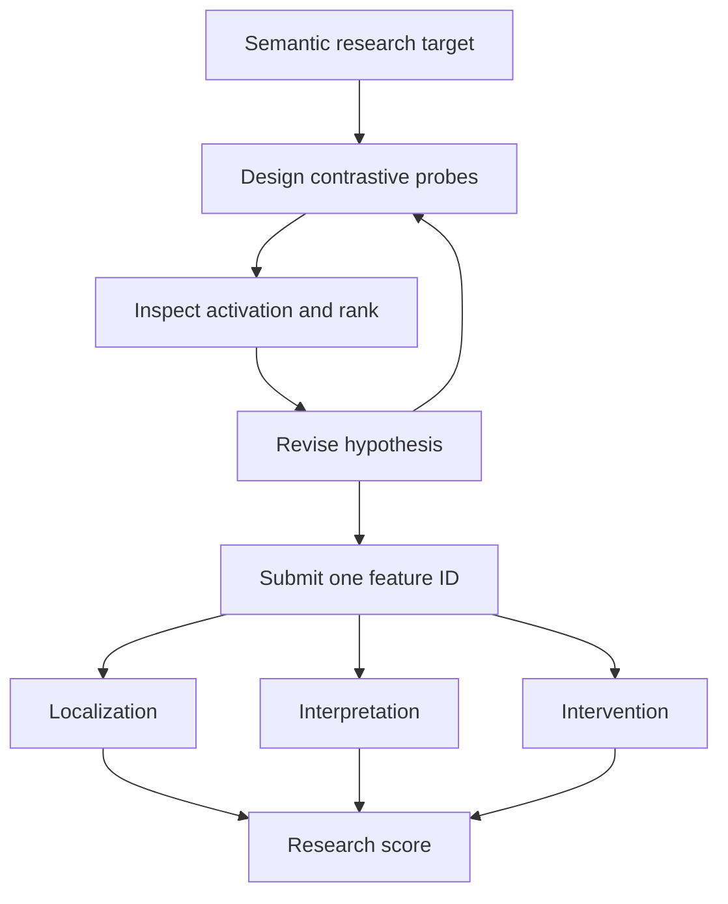

# Figure 1 plan — SAE-Bench autonomous research loop

## Reader need

After seeing this figure, the reader should understand that SAE-Bench evaluates an agent as an autonomous interpretability researcher: it designs experiments and revises a hypothesis before hidden evaluation tests localization, interpretation, and intervention.

## Diagram type

Poster flowchart. Three named phase bands separate the public research target, the agent's autonomous investigation loop, and the benchmark's hidden evaluation.

## Structural sketch

## Composition

- Canvas: `680 × 600`, transparent.
- Main flow column: `x=80..470`; annotation column: `x=490..640`.
- Phase 1: fixed semantic target, visible to the agent.
- Phase 2: three agent-owned operations in a loop, ending in one submitted feature ID.
- Phase 3: three hidden evaluation tracks—localization, interpretation, intervention—converging on a research score.
- Palette: gray anchor, purple agent research loop, coral submitted claim, teal hidden evidence, amber final score.

## Labels

- Research target: `Interpret this SAE concept`
- Agent loop: `Design probes`, `Inspect ranks`, `Revise hypothesis`
- Submission: `One feature ID + explanation`
- Hidden evidence: `Localization`, `Interpretation`, `Intervention`
- Outcome: `Research score, not one exact-match bit`

## Validation checklist

- Every text element uses a template class.
- No connector crosses a label.
- No outer background, gradient, shadow, or inline text color.
- Maximum right edge is `640`; bottom content ends by `410`.
- Role colors are anchored by phase labels and node titles.
- Render in both light and dark color schemes before publication.
