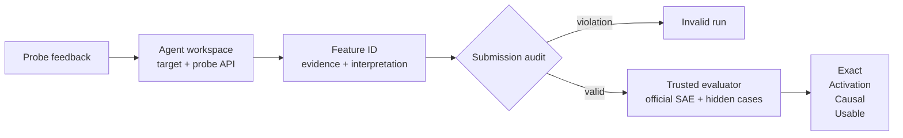

# Figure 1 plan — SAEScientist-Bench system design

## Reader need

The figure specifies the benchmark boundary: what the agent receives, what it can change, what it submits, and which hidden evaluators produce each reported metric.

## Diagram type

Horizontal system architecture, aligned with the visual grammar of the PostTrainBench⁰ system figure.

## Structural sketch

## Composition

- Canvas: `1080 × 470`, transparent.
- Left: agent-visible target, restricted probe API, and writable research artifacts.
- Center: one submitted feature claim and a trace/schema audit gate.
- Right: trusted hidden evaluation followed by a decomposed scorecard.
- Bottom: frozen protocol constraints.
- Palette: neutral gray, PostTrainBench blue, one orange control path, and pale score highlight.

## Validation checklist

- The hidden evaluator never feeds scores back into discovery.
- The only iterative feedback comes from the restricted probe API.
- Expert ID, frozen evaluation cases, and steering judgments remain hidden until scoring.
- Exact, activation, causal, and usable outcomes are visibly separate.
- No gradient, shadow, or decorative background.
